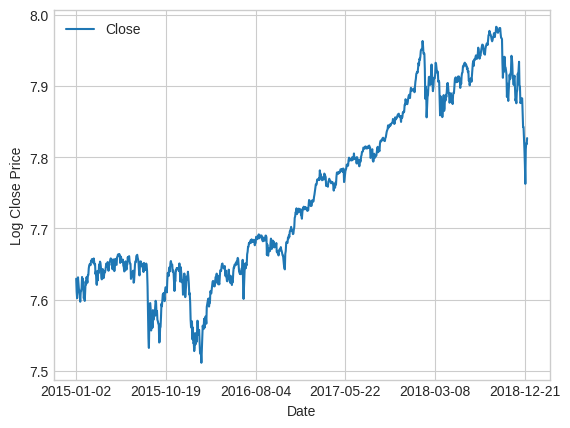
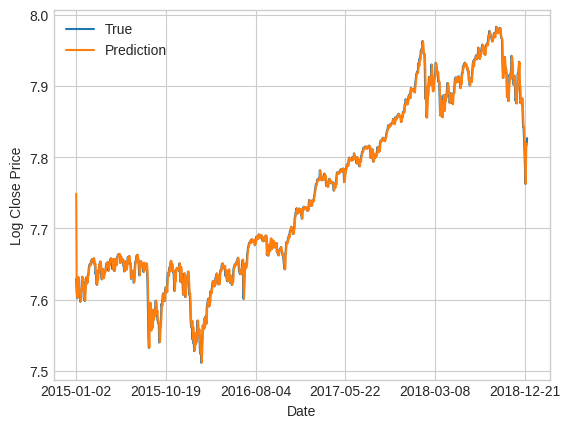
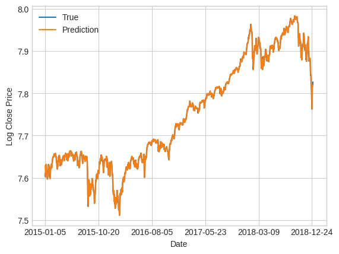

# 1.2 ARMA vs ARIMA Models for Financial Applications


```python
import pandas as pd
import matplotlib.pyplot as plt
import numpy as np
from statsmodels.tsa.arima.model import ARIMA
from statsmodels.tsa.ar_model import AR
import copy
plt.style.use('seaborn-v0_8-whitegrid')
```

## Question 1


```python
snp = pd.read_csv('../../Data/snp_500_2015_2019.csv')
snp.set_index(['Date'], inplace=True)
snp_close = snp['Close'].to_frame().apply(np.log)
snp_close.index = snp_close.index
snp_close.plot(y='Close', xlabel="Date", ylabel="Log Close Price")
```


    <Axes: xlabel='Date', ylabel='Log Close Price'>


    

    


Looking at this we can see a clear trend within the data meaning that an ARMA model would not be effective, on the other hand the use of an ARIMA model could be effective at taking the overall trend in the data out.

## Question 2


```python
snp_arma = copy.deepcopy(snp_close)
snp_arma.columns = ['True']
model = ARIMA(snp_arma, order=(1,0,0)).fit()
print(model.params)
snp_arma['Res'] = model.resid
snp_arma['Prediction'] = snp_arma['True'] - snp_arma['Res']
snp_arma.plot(y=["True", "Prediction"], xlabel="Date", ylabel="Log Close Price")

```

    /home/omalley242/University/MIF/MIF_VENV/lib/python3.12/site-packages/statsmodels/tsa/base/tsa_model.py:473: ValueWarning: A date index has been provided, but it has no associated frequency information and so will be ignored when e.g. forecasting.
      self._init_dates(dates, freq)
    /home/omalley242/University/MIF/MIF_VENV/lib/python3.12/site-packages/statsmodels/tsa/base/tsa_model.py:473: ValueWarning: A date index has been provided, but it has no associated frequency information and so will be ignored when e.g. forecasting.
      self._init_dates(dates, freq)
    /home/omalley242/University/MIF/MIF_VENV/lib/python3.12/site-packages/statsmodels/tsa/base/tsa_model.py:473: ValueWarning: A date index has been provided, but it has no associated frequency information and so will be ignored when e.g. forecasting.
      self._init_dates(dates, freq)
    /home/omalley242/University/MIF/MIF_VENV/lib/python3.12/site-packages/statsmodels/base/model.py:607: ConvergenceWarning: Maximum Likelihood optimization failed to converge. Check mle_retvals
      warnings.warn("Maximum Likelihood optimization failed to "


    const     7.748867
    ar.L1     0.997354
    sigma2    0.000074
    dtype: float64


    <Axes: xlabel='Date', ylabel='Log Close Price'>


    

    


Idk what this means --> Inspect the model parameters (model.params). Comment on the results.

These findings are not useful as we have trained the model on the whole of the supplied dataset over fitting it and as such the accuracy is high, but we do not know the real performance without applying it against an unseen dataset.

## Question 3


```python
snp_arima = copy.deepcopy(snp_close)
snp_arima.columns = ['True']
model = ARIMA(snp_arima, order=(1,1,0)).fit()
print(model.params)
snp_arima['Res'] = model.resid
snp_arima['Prediction'] = snp_arima['True'] - snp_arima['Res']
snp_arima = snp_arima.iloc[1:] #drop first row as the ARIMA pred is delay by 1 and fails on first iter i think
snp_arima.plot(y=["True", "Prediction"], xlabel="Date", ylabel="Log Close Price")

```

    /home/omalley242/University/MIF/MIF_VENV/lib/python3.12/site-packages/statsmodels/tsa/base/tsa_model.py:473: ValueWarning: A date index has been provided, but it has no associated frequency information and so will be ignored when e.g. forecasting.
      self._init_dates(dates, freq)
    /home/omalley242/University/MIF/MIF_VENV/lib/python3.12/site-packages/statsmodels/tsa/base/tsa_model.py:473: ValueWarning: A date index has been provided, but it has no associated frequency information and so will be ignored when e.g. forecasting.
      self._init_dates(dates, freq)
    /home/omalley242/University/MIF/MIF_VENV/lib/python3.12/site-packages/statsmodels/tsa/base/tsa_model.py:473: ValueWarning: A date index has been provided, but it has no associated frequency information and so will be ignored when e.g. forecasting.
      self._init_dates(dates, freq)


    ar.L1    -0.008170
    sigma2    0.000074
    dtype: float64
    ar.L1    -0.008170
    sigma2    0.000074
    dtype: float64


    

    


## Question 4

why do we take log prices?
